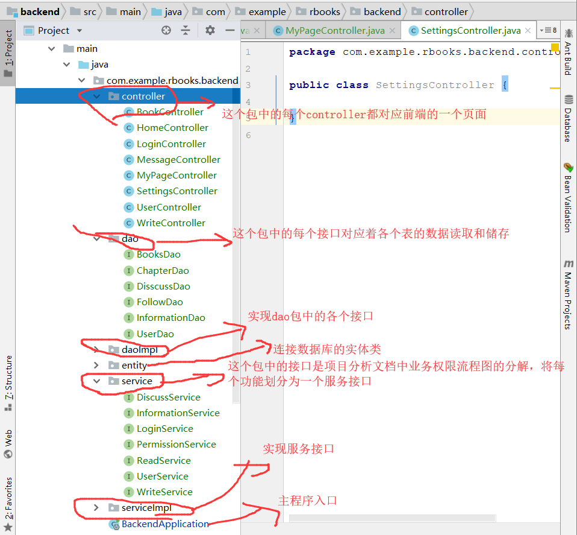
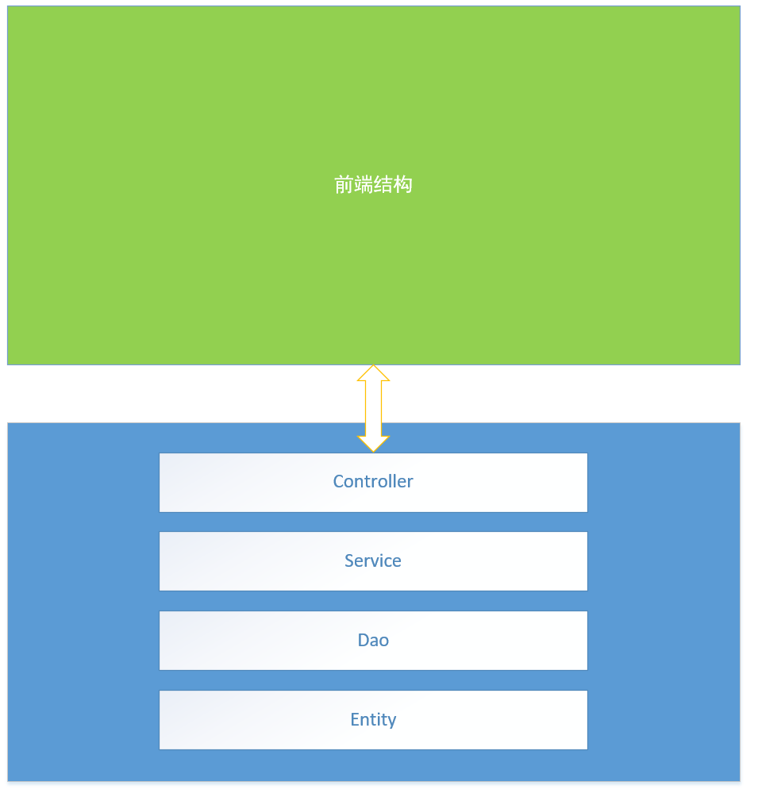

### 用于实践所学的小站点，reactNative springboot mysql

---

模仿的Love2站点，自己做的简单项目。[love2](https://love2.io) 

##### 2019.3.4~2019.3.7

​	这段时间我完成了项目的前期初步工作。包括最初照着love2网站一步步用Axure画的原型图[在这里](https://orbkd6.axshare.com 
) ，包括项目中也有RP文件，系统功能图，业务流程图，用例图，模块设计，数据库设计等等。

初步的分析见这个文档  [项目初步分析](https://github.com/krystalics/RBooks/blob/master/RBook%E9%A1%B9%E7%9B%AE%E9%9C%80%E6%B1%82%E5%88%86%E6%9E%90.docx)

---

编码之后，才真正的感受到前期工作的作用。整个后台项目的结构在写前期文档的时候逐渐变得清晰，每一个功能或者用例都对应着后台提供的服务，加上清晰的模块划分，几天内就能将业务关系不复杂的系统做出来。

**以service为中心，通过调用dao读取和储存数据，反应到controller中，最后与前端完成交互**

更加抽象的层面如下图：

划分完层次结构之后，首先的步骤：

1. 把DAO的接口设计出来，这一步基本就是将增删改查包装一下然后实现。
2. 然后把Service的接口设计并实现
3. 最后写出Controller，调用Service的实现
4. 前端访问Controller，就可以

正常的步骤就是这样，还有一些模块比如，Session和Security以及其他细节暂时不涉猎，这里作为V0.2版本的Release。