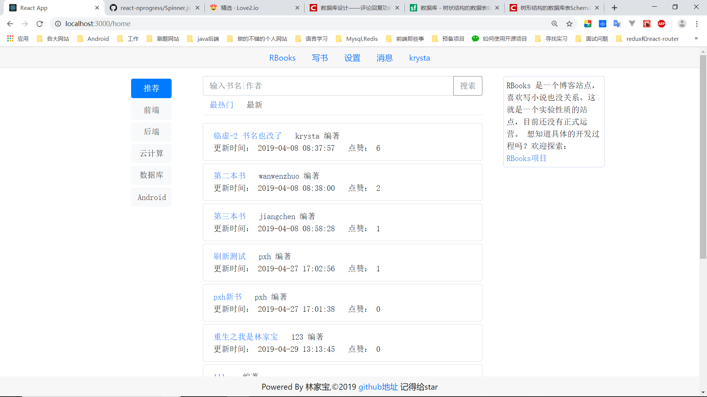
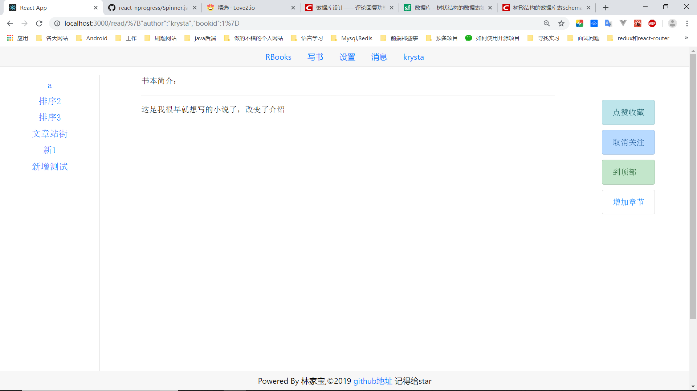
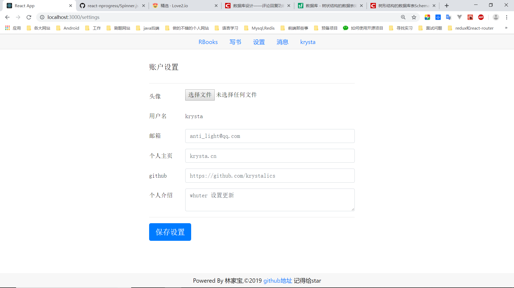
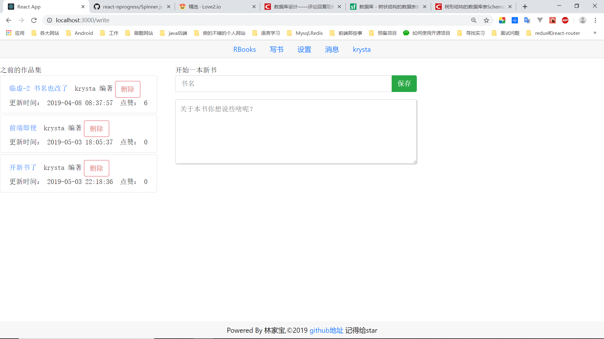

### 用于实践所学的小站点，react springboot mysql

---

模仿的Love2站点，自己做的简单项目。[love2](https://love2.io) 

项目建立时间是2019.2.24 ，当时只是有这个模糊的想法，直到后面才开始陆续启动工作。

**0.1版本**: 完成了前期的设计工作。**2019.3.4~2019.3.14**

**0.2版本**: 完成后台的基本功能  **2019.3.15~2019.3.19**，缺陷还有很多比如：一个用户在一个章节中只能评论一次，之后的评论只是更新那个评论。对数据的格式并没有进行筛查，不能发现不合法数据(很多可能都会让程序运行产生各种错误，然后返回的数据就是错误的信息，相信用户一定不希望看到这种场面)  。

*ps(原定)*下一版本的任务是：使用 Spring-session 和redis搭建起一定期限内可以免登录的站点，Shiro来做权限支持。前端的页面也可以开始动起来了。 改善0.2 版本的不足。

> cookie已经用简易的前端代码搞定了，至于权限的部分还没做  2019.4.4

**0.3版本**：前端基本功能实现  **2019.3.20~2019.4.1**

**0.4版本**：修复上一版本的各种bug并将外观渲染完毕 , 用的react-bootstrap **2019.4.1~2019.4.4**

**2019.3.19** [后端开发文档](https://github.com/krystalics/RBooks/blob/master/%E5%BC%80%E5%8F%91%E7%AC%94%E8%AE%B0.markdown) [前端开发文档](https://github.com/krystalics/RBooks/blob/master/%E5%89%8D%E7%AB%AF%E5%BC%80%E5%8F%91%E7%AC%94%E8%AE%B0.markdown)

------

环境配置：Node.js （最好是高版本的,react对这有要求），然后就可以安装npm或者yarn了

MySQL 5.7+  

JDK 1.8

IDE：IDEA ，WebStorm

项目运行流程：

1. 先down下本项目 (如果顺便给个star那简直完美)
2. 将项目中的rbooks.sql文件导入你的MySQL数据库(我的数据库版本是5.7+)，如果数据库版本不兼容可以参照我的数据库设计图(在前期分析文档中) 自己创建一个数据库，可能比较麻烦。然后需要在MySQL中创建一个角色`username=user_rbooks  password=123456` ，赋予它关于rbooks数据库的权限。
3. 用IDEA 打开backend，然后点击运行。中间可能出现各种bug，很可能是Maven版本，或者各个依赖的版不一样。
4. 然后用WebStorm 打开frontend文件夹，直接在前端项目的根目录`npm start | yarn start`就可以在浏览器的 `http://localhost:3000` 看到运行情况了，如果不出意外的话。

最后给出项目运行时的一些截图：

