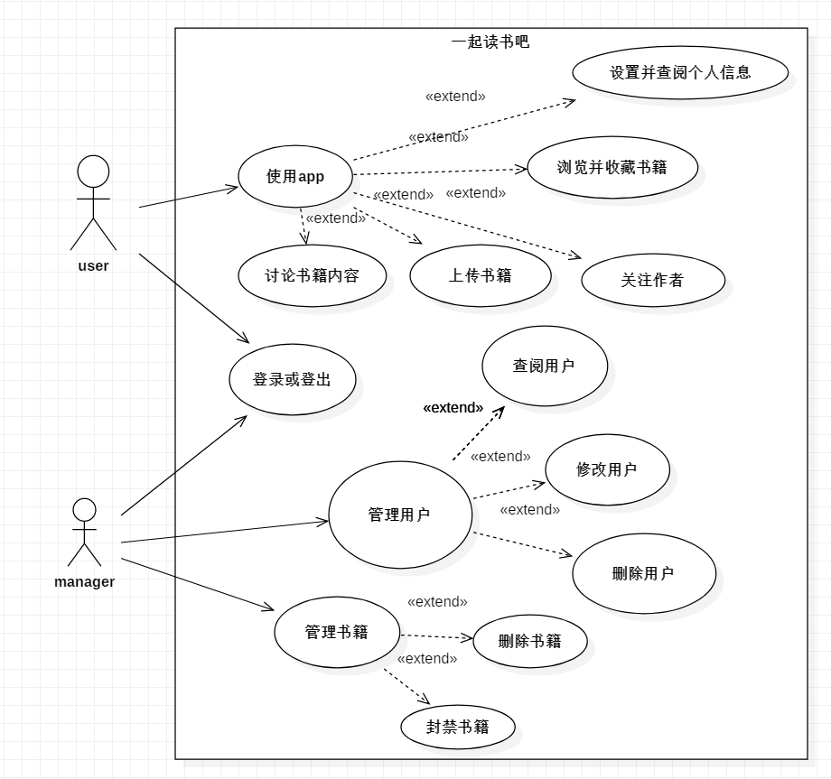
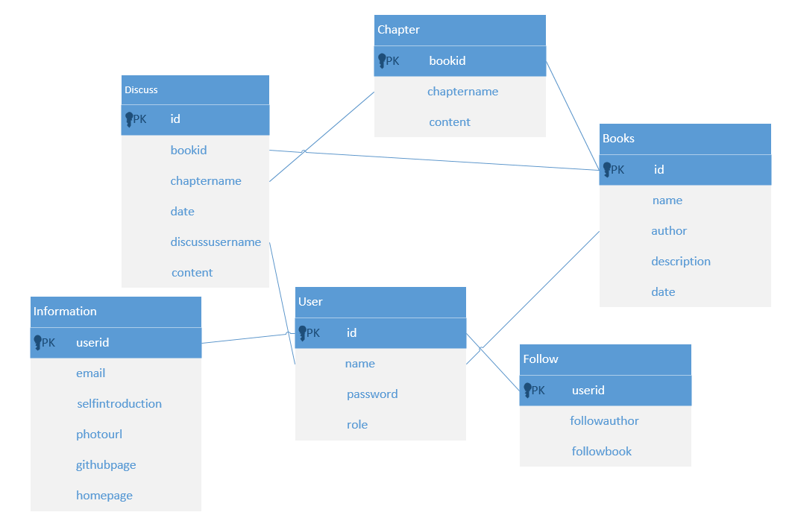

### 用于实践所学的小站点，reactNative springboot mysql redis

---

模仿的Love2站点，自己做的简单项目。[love2](https://love2.io) 

##### 2019.3.4~2019.3.7

​	这段时间我完成了项目的前期初步工作。包括最初照着love2网站一步步用Axure画的原型图[在这里](https://orbkd6.axshare.com 
) ，包括项目中也有RP文件，系统功能图，业务流程图，用例图，模块设计，数据库设计等等。

## 项目需求分析——初步

**系统名称：**一起读书吧

**数据录入：**通过用户注册收集用户数据，至于书本的数据暂时不用真实内容。或许可以尝试解析pdf或者txt文件**。**

**系统功能模块：**

​	 系统由五个大的功能模块组成，每个大功能模块由若干个小的功能模块组成，如上图所示，能基本满足一般用户的需求。

 

**用户与权限管理：**

**用户角色：**一般用户，管理用户

**权限级别：**管理用户比一般用户多了几个功能：删除，修改，查阅用户信息

**数据可视性：**普通用户只能看见自己的信息，而管理用户可以看见所有用户信息。

   

**用例设计：**

 

**模块设计：**

**后台：**

Dao模块：是关于数据库的接口，包括连接数据库(使用ORM框架)，封装一层接口给其他模块使用。

Config模块：由于后台使用的是Spring Boot框架，需要配置各种文件，可以专门的给出一个模块分清楚其中的关系

Controller模块：直接和前端交互的接口，接收和发送数据

DataProcessing模块：负责处理需要发送到前端的数据，和处理从前端接收的数据到数据库中

​        Logic模块：负责处理业务逻辑

​        以及其他暂时没想到的模块。不好意思，限于笔者的水平，暂时只能看到这个长度了。

**前端：**

​     Navigate模块：在app底端的导航栏

​     State模块：简单的显示该页面处于哪个页面，位于app的顶部

​     Container模块：主功能区，里面又划分为多个小模块

​         Comment模块：评论模块，很重要的部分

​         Message模块：显示他人对自己书中章节的评论，和他人对自己的回复。不提供用户之间的socket，毕竟这可能需要设计到消息中间件，目前还没有涉及到这方面。

​         Books模块：显示从数据库中get的书名，作者，时间等信息，做一个列表往下铺。

​         Self_information模块：显示个人信息，里面的数据可以从设置进入修改

​     Login模块：负责登录逻辑

 

前端的原型发布在axure云上，还是比较简陋的界面，没有配色和icon纯文字。见谅

 

 

 **数据库设计：**

    

 

 